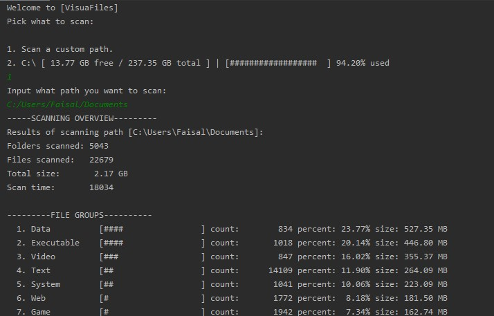
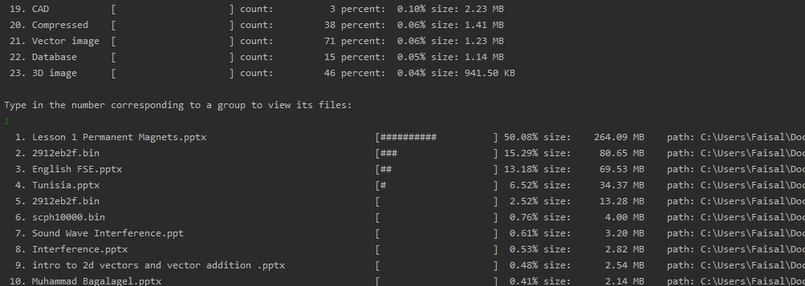

# VisuaFiles
 VisuaFiles scans your files and organizes them in file groups that allows you to easily see
 exactly what type of files make up your drive or directory. VisuaFiles allow you to
 then view the files in each group (in sorted order from biggest size to smallest) and open
 them in file explorer or delete them.
 
 Files are organized in file groups based on how they are grouped on https://fileinfo.com
 They are stored on text files in the DATA folder and the user can add extensions to those lists
 or even create their own file groups (though its likey they will not need to since thousands of extensions 
 are already loaded on the textfiles).
 
 ## ScreenShots:
  Viewing file groups:
  
  
  
  Viewing files:
  
  
 
 
 
 
