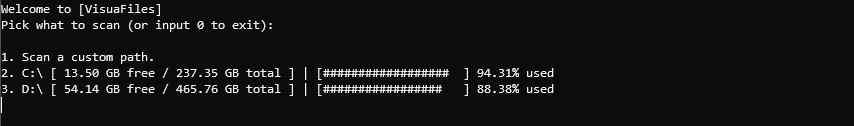

# VisuaFiles

 VisuaFiles scans your files and organizes them in file groups that allows you to easily see
 exactly what type of files make up your drive or directory. 

 VisuaFiles is unique since it organizes your files in custom file groups based on how they 
 are grouped on https://fileinfo.com.

 They can be viewed in these custom groups or viewed in groups based on the files extensions.
 Custom file groups are loaded from text files in the DATA folder and the user can add more 
 extensions to those lists or even create their own file groups.
 
 ## Usage
 Here are some basic instructions and screenshots on how to use VisuaFiles.

 ### Drive menu
 When you first load VisuaFiles, you will greeted with this screen showing info about your drives
 and allows you to scan one of them or scan a custom directory:

 

 ### Scan Summary
 Once your drive or directory of choice is done scanning, a scan summary will appear detailing information
 about the scan. The first line shows how many extensions in your drive/directory that were matched in the text 
 files in the DATA folder. Extensions not found will be found in the Other Files group. Also on this screen you 
 choose how you want to view your files, either organized by the custom file groups (1) or listed by extensions (2).
 
 

 ### File Group View
 If you picked (1) from the previous screen, you will see this file group view screen. Each group (which will be named based 
 on the name of its corressponding text file) you see here has a certain amount extensions in it (which are based 
 on the data in its text file) and contains all the files of those extensions. Beside each group is its ID, which 
 you can use to pick which groups files you want to view.

 
 ### Extension Group View
 If you picked (2) from the previous screen, you will see this extension group screen. This screen is useful if you want to see
 what file types (by extension) are taking up space on your drive/directory.

 

 ### Viewing files
 Once you you pick a group from either the file group view or extension group view, you will see the files in that group 
 (you will see 20 at the start). They are sorted from biggest to smallest file size to easily show which files are taking  
 up the most space on your drive/directory. You can interact with these files with the following commands:
  
 - **del (file num):**  Permenantly delete the specified file (you can't bring it back from the recycle bin).
                        It will ask you to confirm the deletion (to make sure you don't delete the wrong file by mistake)
                        Example command: del 12 
 - **open (file num):** Opens the specified file in file explorer.
                        Example command: open 12
 - **view:**            Prints the files again.
                        Example command: view
 - **load (file num):** Loads the next (file num) files.
                        Example command: load 20
 - **prev(file num):**  Loads the previous (file num) files.
                        Example command: prev 20
 - **back:**            Goes back to the previous screen (file group view/extension group view).
                        Example command: back
 - **exit:**            Exits the program.
                        Example command: exit

 
 
 ## Downloads
  Download from the [Release Page](https://github.com/Fossilia/VisuaFiles/releases). 
  As of now, only Windows machines are directly supported but you can build the program yourself
  on Linux or Mac.
 
